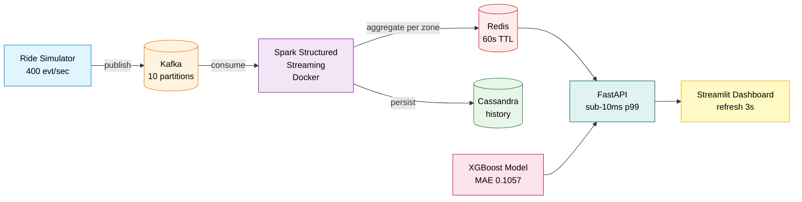
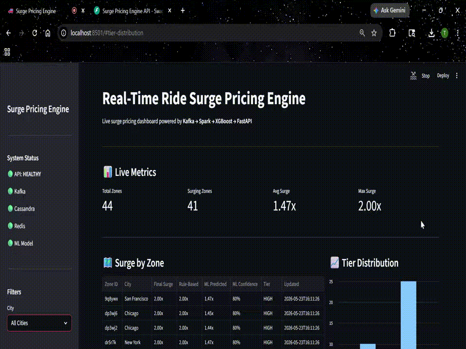
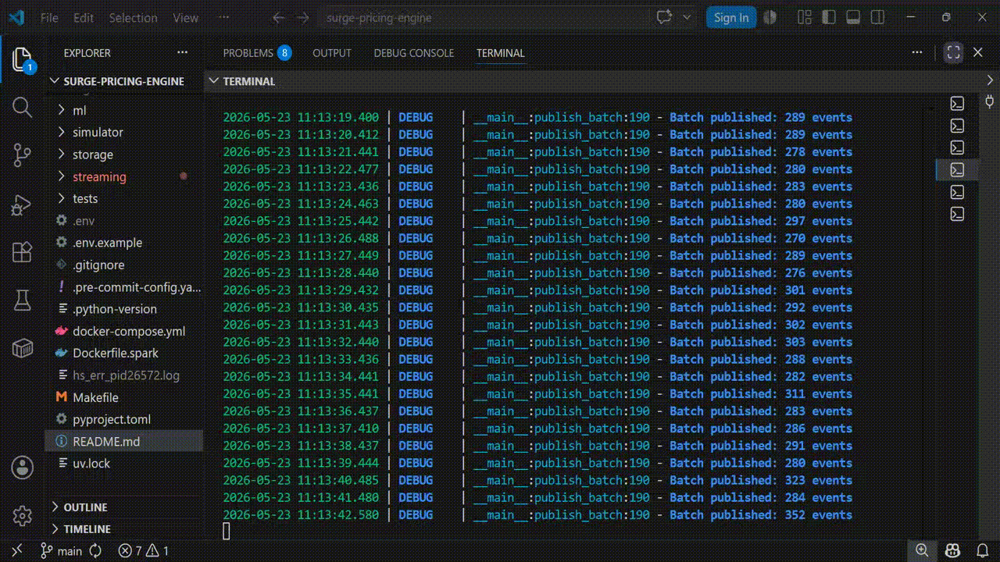
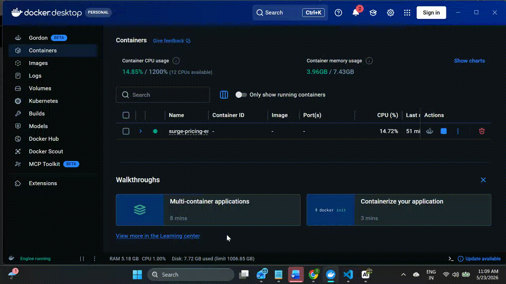

# Real-Time Ride Surge Pricing Engine


[](https://www.python.org/)
[](https://spark.apache.org/)
[](https://kafka.apache.org/)
[](https://redis.io/)
[](https://cassandra.apache.org/)
[](https://fastapi.tiangolo.com/)
[](https://streamlit.io/)
[](https://xgboost.readthedocs.io/)
[](https://www.docker.com/)
[](LICENSE)


A production-grade real-time data engineering pipeline that simulates ride-share demand across 44 geo-hashed zones in three US cities and computes surge pricing in under 5 seconds end-to-end. Combines Apache Kafka, Spark Structured Streaming, Redis, an XGBoost ML model, and a FastAPI + Streamlit serving layer — all orchestrated through Docker Compose.

---

## Architecture



## Demo

### Live Dashboard


### Pipeline in Action


### REST API and Docker Infrastructure


---

## Tech Stack

| Layer            | Technology                                                  |
| ---------------- | ----------------------------------------------------------- |
| Messaging        | Apache Kafka 7.5, Zookeeper, Confluent Schema Registry      |
| Stream Processing | Apache Spark 3.5.0 (Structured Streaming) on Docker        |
| Storage          | Cassandra 4.1 (durable), Redis 7.2 (cache, TTL)             |
| ML               | XGBoost, scikit-learn (21 engineered features)              |
| Serving          | FastAPI (Uvicorn ASGI)                                      |
| Dashboard        | Streamlit                                                   |
| Orchestration    | Docker Compose                                              |
| Language / Tooling | Python 3.11, uv, loguru, Pydantic Settings, pytest        |

---

## Key Features

- **End-to-end real-time pipeline** — ride request published to Kafka, processed by Spark, written to Redis, served by FastAPI, and rendered on the dashboard in under 5 seconds.
- **Hybrid surge architecture** — rule-based safety floor combined with an XGBoost optimizer (MAE 0.1057, R² 0.8415).
- **21-feature ML pipeline** — combines real-time demand signals, simulated supply, weather (via Open-Meteo API), US public holidays, time-of-day, and events.
- **44 geo-hashed zones** across New York, San Francisco, and Chicago, each tracked independently.
- **Containerized Spark** — runs on Linux inside Docker, avoiding Windows JVM compatibility issues and matching production deployments.
- **Sub-10ms API latency** — Redis cache hits served by FastAPI in well under a frame.
- **Full test suite** — 31 unit tests covering surge calculation, feature engineering, Kafka producer, and ML serving.

---

## Quick Start

### Prerequisites

- Docker Desktop
- Python 3.11
- [uv](https://docs.astral.sh/uv/) (`pip install uv`)

### 1. Clone and install

```bash
git clone https://github.com/tejaswini-keerthi/surge-pricing-engine.git
cd surge-pricing-engine
cp .env.example .env
uv sync
```

### 2. Start infrastructure (Kafka, Spark, Cassandra, Redis)

```bash
docker compose up -d
```

Wait ~60 seconds for all containers to report healthy:

```bash
docker compose ps
```

### 3. Train the ML model

```bash
uv run python -m ml.train_model
```

### 4. Run the pipeline (each in its own terminal)

```bash
# Terminal 1 — start producing ride requests
uv run python -m simulator.kafka_producer

# Terminal 2 — start the API
uv run uvicorn api.main:app --host 0.0.0.0 --port 8000

# Terminal 3 — start the dashboard
uv run streamlit run dashboard/app.py
```

### 5. Open the dashboard

Visit [http://localhost:8501](http://localhost:8501) and watch surge pricing update live across 44 zones.

API docs are at [http://localhost:8000/docs](http://localhost:8000/docs).

---

## Project Structure

```
surge-pricing-engine/
│
├── api/                        FastAPI server — 7 endpoints, Redis-backed
│   ├── main.py
│   └── models.py
│
├── config/                     Pydantic Settings with nested config groups
│   └── settings.py
│
├── dashboard/                  Streamlit dashboard with 3s auto-refresh
│   └── app.py
│
├── ml/                         Feature engineering, training, serving
│   ├── feature_engineering.py
│   ├── train_model.py
│   ├── serve_model.py
│   └── models/                 Trained .pkl artifacts (gitignored)
│
├── simulator/                  Kafka producer for ride request events
│   ├── ride_simulator.py
│   ├── kafka_producer.py
│   └── weather_client.py
│
├── storage/                    Database clients
│   ├── cassandra_writer.py     Durable history writer
│   ├── redis_cache.py          Sub-10ms surge cache
│   └── schema.cql              Cassandra DDL
│
├── streaming/                  Spark Structured Streaming job
│   ├── spark_streaming_job.py
│   ├── surge_calculator.py
│   └── watermark_config.py
│
├── tests/                      31 unit tests
│   ├── conftest.py
│   ├── test_surge_calculator.py
│   ├── test_feature_engineering.py
│   ├── test_kafka_producer.py
│   └── test_serve_model.py
│
├── docs/                       Demo video, screenshots
├── docker-compose.yml          6-service infrastructure
├── Dockerfile.spark            Apache Spark + Python 3 image
├── pyproject.toml              uv dependencies
├── uv.lock                     Reproducible lock file
└── README.md
```

## Surge Pricing Logic

Each 5-second micro-batch:

1. Spark consumes the most recent Kafka events.
2. Aggregates demand and supply per zone.
3. Computes a **rule-based multiplier** as a safety floor:
   - `supply_ratio = demand / available_drivers`
   - Multiplier scales from 1.0× (normal) up to 3.0× (maximum) by thresholds.
4. Generates 21 features (time-of-day, weather, holidays, events, supply ratios).
5. The XGBoost model predicts the optimized multiplier.
6. The **final multiplier** uses the ML prediction when confidence is high, falling back to the rule-based floor otherwise — matching the hybrid approach used by Uber and Lyft.
7. Writes the result to Redis with a 60-second TTL.

---

## Performance

| Metric                       | Value                  |
| ---------------------------- | ---------------------- |
| Kafka throughput (simulated) | 400+ events / sec      |
| End-to-end latency           | < 5 seconds            |
| API p99 latency              | < 10 ms (Redis cache)  |
| Zones tracked                | 44 across 3 cities     |
| ML model accuracy            | MAE 0.1057, R² 0.8415  |
| Top ML features              | event multiplier (30.8%), weather (27.4%), drivers (12.2%), rush hour (8.9%), holiday (7.7%) |

---

## Engineering Decisions

- **Stateless per-batch aggregation** over windowed stateful streams — chosen for simplicity and to avoid the HDFS state-store delta-file issues that plague Spark Structured Streaming on Windows. Each batch aggregates only the events it received; demand history is reconstructed at query time.
- **Cassandra + Redis hybrid storage** — Cassandra holds the historical record; Redis caches the latest surge per zone with TTL for sub-10ms reads.
- **Geo-hashing** (`pygeohash`) for zone identification — gives spatial locality at variable precision without needing PostGIS.
- **uv over pip** — drastically faster dependency resolution and reproducible lock files via `pyproject.toml` + `uv.lock`.
- **Docker for Spark** — avoids all Windows native library compatibility issues and mirrors how Spark runs in production.

---

## Testing

```bash
uv run pytest -v
```

31 tests across:
- `test_surge_calculator.py` — rule-based multiplier and tier boundaries
- `test_feature_engineering.py` — feature pipeline correctness
- `test_kafka_producer.py` — event schema and producer config
- `test_serve_model.py` — ML serving layer

---

## Roadmap

- [ ] Add Prometheus + Grafana for operational observability
- [ ] Replace JSON with Avro + Schema Registry for stricter event contracts
- [ ] Promote the Spark job to a stateful windowed implementation on Linux
- [ ] Integrate with a React frontend (the planned companion Uber-clone project)

---

## License

MIT — see [LICENSE](LICENSE).

## Author

**Tejaswini Keerthi** — [GitHub](https://github.com/tejaswini-keerthi) · [LinkedIn](https://linkedin.com/in/tejaswini-keerthi)
